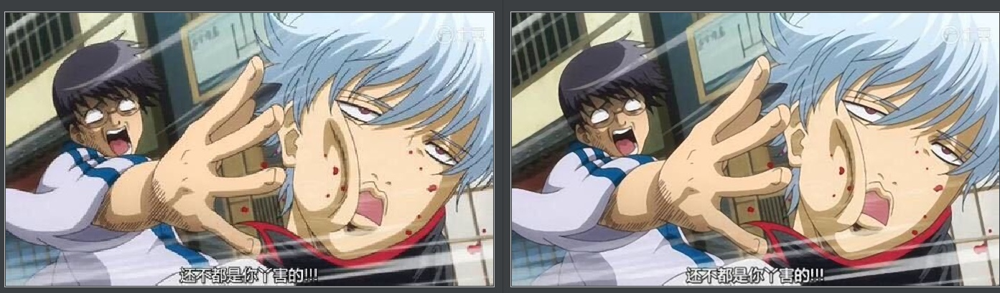

### Anime4KTool

Anime4K Java implementation, upscale your png or gif picture

### Unit Test
- Run with "mvn test"
- Or you can run some test case only
- Test Case In src/test/java/com/github/icemap folder

### Result

### Usage
- PNG
~~~[java]
ConvertPic convertPic = new ConvertPic(20);
String testResPath = this.getClass().getResource("/").getPath();
BufferedImage img = ImageIO.read(new File(testResPath + "gintama.jpg"));
img = convertPic.picTo4K(img);
ImageIO.write(img, "png", new File(testResPath + "gintama-2x.png"));
~~~

- GIF
~~~[java]
ConvertGif convertGif = new ConvertGif(20);
String testResPath = this.getClass().getResource("/").getPath();
convertGif.gifTo4K(new FileInputStream(new File(testResPath + "sakura.gif")), testResPath + "sakura-2x.gif");
~~~

- You can see usage in unit case, too.
